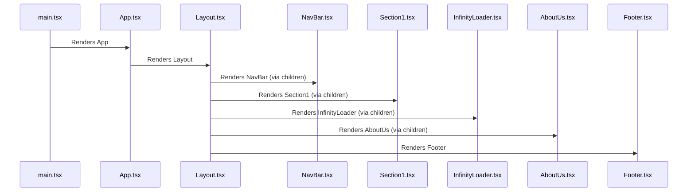

# Technical Architecture and Workflow

This document provides a comprehensive overview of the frontend architecture, component interactions, and workflows within the application. It focuses on the structure defined by the provided files, including `main.tsx`, `App.tsx`, `Layout.tsx`, and the various components located in the `components` directory.

## System Overview

The frontend is structured as a React application, utilizing functional components and JSX syntax. The core structure revolves around the `App` component, which serves as the root component. `App` renders a `Layout` component, which provides a consistent structure across different sections of the application. Several components, such as `NavBar`, `Section1`, `InfinityLoader`, and `AboutUs`, are lazily loaded and rendered within the `App` component. The `Footer` component is also lazily loaded within the `Layout` component.

## Component Architecture

The application follows a component-based architecture. Each component is responsible for rendering a specific part of the user interface and managing its own state (if any).

### 1. `main.tsx`

This is the entry point of the React application. It uses `react-dom/client` to render the `App` component into the DOM.

```typescript
import { createRoot } from "react-dom/client";
import App from "./App.tsx";
import "./index.css";

createRoot(document.getElementById("root")!).render(
  <React.StrictMode>
    <App />
  </React.StrictMode>
);
```

### 2. `App.tsx`

The `App` component is the main application component. It imports and renders the `Layout`, `NavBar`, `Section1`, `InfinityLoader`, and `AboutUs` components using React's lazy loading mechanism.

```typescript
import React, { Suspense } from "react";
const Layout = React.lazy(() => import("./Layout"));
const NavBar = React.lazy(() => import("./components/Navbar"));
const Section1 = React.lazy(() => import("./components/section-1"));
const InfinityLoader = React.lazy(() => import("./components/InfinityLoader"));
const About = React.lazy(() => import("./components/AboutUs"));
function App() {
  return (
    <>
      <Suspense fallback={<div>Loading...</div>}>
        <Layout>
          <NavBar />
          <Section1 />
          <InfinityLoader />
          <About />
        </Layout>
      </Suspense>
    </>
  );
}

export default App;
```

**Explanation:**

-   `React.lazy` is used for code splitting, improving initial load time by loading components only when they are needed.
-   `Suspense` provides a fallback UI (e.g., "Loading...") while the lazily loaded components are being fetched.
-   The `Layout` component wraps the other components, providing a consistent structure.
-   `NavBar`, `Section1`, `InfinityLoader`, and `AboutUs` are rendered within the `Layout`.

### 3. `Layout.tsx`

The `Layout` component provides a consistent layout for the application. It renders the `Footer` component using React's lazy loading mechanism.

```typescript
import React from "react";
const Footer = React.lazy(() => import("./components/Footer"));
// eslint-disable-next-line @typescript-eslint/no-explicit-any
export default function Layout({ children }: any) {
  return (
    <div className="min-h-screen flex flex-col">
      <main className="flex-grow">
        {children}
      </main>
      <Suspense fallback={<div>Loading Footer...</div>}>
        <Footer />
      </Suspense>
    </div>
  );
}
```

**Explanation:**

-   The `children` prop allows the `Layout` component to render any content passed to it.
-   The `Footer` component is lazily loaded and rendered at the bottom of the layout.
-   CSS classes (`min-h-screen`, `flex`, `flex-col`, `flex-grow`) are used for styling the layout.

### 4. `components/Navbar.tsx`

The `NavBar` component renders the navigation bar.

```typescript
export default function NavBar() {
  return (
    <>
      {/* Navbar content goes here */}
    </>
  );
}
```

### 5. `components/section-1.tsx`

The `Section1` component renders the first section of the application.

```typescript
export default function Section1() {
  return (
    <>
      {/* Section 1 content goes here */}
    </>
  );
}
```

### 6. `components/InfinityLoader.tsx`

The `InfinityLoader` component likely implements infinite scrolling functionality.

```typescript
export default function InfinityLoader() {
  return (
    <>
      {/* Infinity Loader content goes here */}
    </>
  );
}
```

### 7. `components/AboutUs.tsx`

The `AboutUs` component renders the "About Us" section.

```typescript
export default function About() {
  return (
    <>
      {/* About Us content goes here */}
    </>
  );
}
```

### 8. `components/Footer.tsx`

The `Footer` component renders the footer of the application, including the current year.

```typescript
export default function Footer() {
  const currentYear = new Date().getFullYear();
  return (
    <>
      {/* Footer content goes here */}
      <div>&copy; {currentYear}</div>
    </>
  );
}
```

## Data Flow and Workflow

The primary data flow involves rendering the UI components. The `main.tsx` file initiates the process by rendering the `App` component. The `App` component then renders the `Layout` component, which in turn renders the `NavBar`, `Section1`, `InfinityLoader`, and `AboutUs` components. The `Layout` component also renders the `Footer` component.

### Component Rendering Workflow



**Explanation:**

1.  `main.tsx` initiates the rendering process by rendering the `App` component.
2.  `App.tsx` renders the `Layout` component, passing other components as children.
3.  `Layout.tsx` renders the `NavBar`, `Section1`, `InfinityLoader`, and `AboutUs` components through the `children` prop.
4.  `Layout.tsx` also renders the `Footer` component.

## Implementation Details and Gotchas

-   **Lazy Loading:** The use of `React.lazy` is crucial for optimizing the initial load time of the application. However, it's important to handle the loading state using `Suspense` to provide a good user experience.
-   **Error Handling:** Implement error boundaries to catch errors during the rendering of lazily loaded components.
-   **CSS Styling:** The provided code snippets use CSS classes for styling. Ensure that the CSS classes are defined in the `index.css` file or in other CSS modules.
-   **Type Safety:** The `Layout` component uses `any` for the `children` prop. Consider using a more specific type to improve type safety.

## Common Issues and Troubleshooting

-   **Loading Indicators Not Showing:** If the loading indicators provided by `Suspense` are not showing, ensure that the components are actually being lazily loaded and that there are no errors preventing them from loading.
-   **Component Rendering Errors:** If a component fails to render, check the browser console for error messages. Implement error boundaries to prevent the entire application from crashing.
-   **CSS Styling Issues:** If the CSS styling is not applied correctly, ensure that the CSS classes are defined correctly and that the CSS files are imported correctly.

## Advanced Configuration and Customization Options

-   **Theming:** Implement a theming system to allow users to customize the appearance of the application.
-   **Internationalization:** Implement internationalization to support multiple languages.
-   **Accessibility:** Ensure that the application is accessible to users with disabilities by following accessibility best practices.

## Performance Considerations and Optimization Strategies

-   **Code Splitting:** Use `React.lazy` to split the application into smaller chunks, improving initial load time.
-   **Memoization:** Use `React.memo` to memoize components, preventing unnecessary re-renders.
-   **Virtualization:** Use virtualization techniques to efficiently render large lists of data.
-   **Image Optimization:** Optimize images to reduce their file size.

## Security Implications and Best Practices

-   **Cross-Site Scripting (XSS):** Prevent XSS attacks by sanitizing user input and using secure coding practices.
-   **Cross-Site Request Forgery (CSRF):** Prevent CSRF attacks by using CSRF tokens.
-   **Authentication and Authorization:** Implement secure authentication and authorization mechanisms to protect sensitive data.
-   **Dependency Management:** Keep dependencies up to date to prevent security vulnerabilities.
